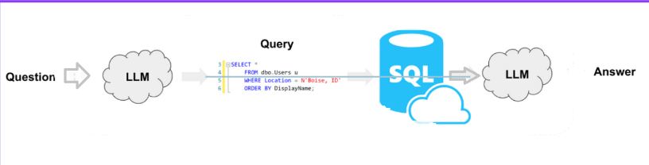
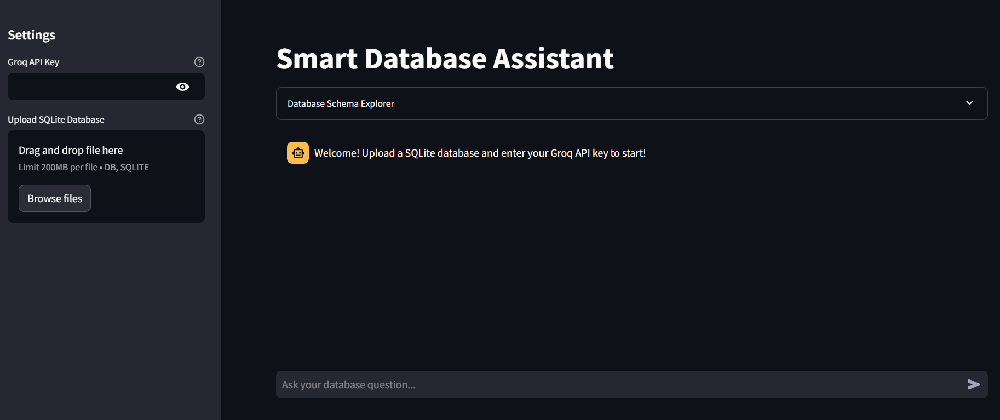

# AI SQL Agent 

The AI SQL Agent is a powerful tool that allows users to interact with SQL databases using natural language queries. Powered by Groq's LLM (Large Language Model) and built with Streamlit, this application simplifies database exploration, querying, and analysis. Whether you're a data analyst, developer, or business user, this tool makes it easy to extract insights from your SQL databases without writing complex SQL queries.
---

## Features 

- **Natural Language Querying**: Ask questions in plain English and get SQL query results.
- **Database Schema Explorer**: View and explore the schema of your SQL database.
- **Interactive Chat Interface**: Chat with the AI agent and see its reasoning process.
- **File Upload Support**: Upload your own SQLite database or use the default Chinook database.
- **Intermediate Step Visualization**: See the agent's thought process and actions in real-time.
- **Error Handling**: Graceful error handling and user-friendly error messages.

---

## Prerequisites 

Before running the application, ensure you have the following:

1. **Python 3.8+**: The application is built using Python.
2. **Groq API Key**: Sign up at [Groq Console](https://console.groq.com) to get your API key.
3. **SQLite Database**: Use the default Chinook database or upload your own `.db` or `.sqlite` file.

---

## Installation 


  Clone the project

  ```bash
    git clone https://github.com/uzairsayyed-005/AI_SQL_AGENT

  ```

  Go to the project directory


  Install dependencies

  ```bash
    pip install -r requirements.txt

  ```

  Start the server

  ```bash
    streamlit run app.py

  ```
  ## Flowchart

  

  ## Application interface

  

  ## License

  This project is licensed under the MIT License. See the LICENSE file for details.

  ## Acknowledgments 

Built with Streamlit and LangChain.

Powered by Groq for LLM inference.

Uses the Chinook Database as the default dataset.

  ##  Contributors

  - **Uzair Sayyed** – [GitHub Profile](https://github.com/uzairsayyed-005)  